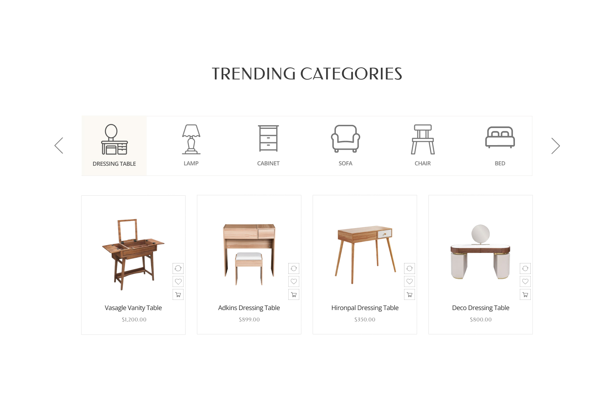

<h1 align = "center">
     
     
    🎗️ Trending Categories 🎗️
     
     
</h1>

    🎗️ One of the landing sections. This project intends to explore git in more detail and improve the experience with it. 🎗️

<h3>Main features:</h3>

 - React.js
 - Scss
 - Git
 - UX & UI design

